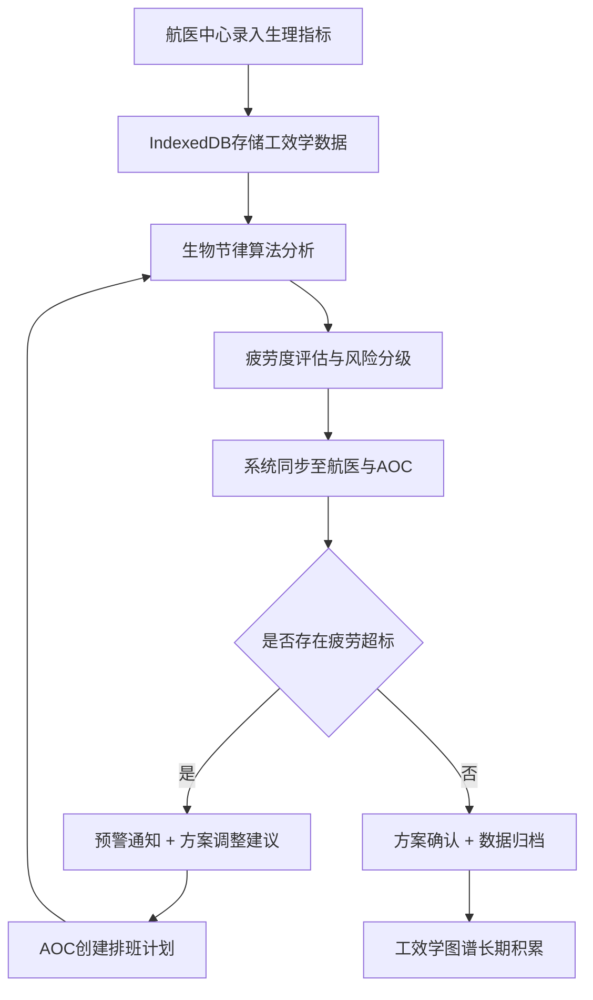

## 1. 产品概述

民航机组疲劳度与排班演化关联性仿真系统，基于Vue 3构建的专业级航空安全管理平台。通过异步生物节律反馈算法评估跨时区飞行对机组人员反应时的影响，实现航医中心生理指标与AOC运行控制排班计划的逻辑同步，支撑大型航司跨国航线的高弹性安全管理。

- **核心价值**：将机组生理状态与排班决策深度融合，降低疲劳相关运行风险
- **目标用户**：航医中心医师、AOC运行控制员、航班调度管理人员
- **技术创新**：IndexedDB长周期工效学图谱存储 + 生物节律反馈算法

## 2. 核心功能

### 2.1 用户角色

| 角色 | 登录方式 | 核心权限 |
|------|----------|----------|
| 航医医师 | 工号登录 | 生理指标录入、健康评估、疲劳预警发布 |
| AOC调度员 | 工号登录 | 排班计划管理、航班调整、疲劳风险查看 |
| 系统管理员 | 管理员账号 | 用户管理、参数配置、系统日志 |

### 2.2 功能模块

1. **综合驾驶舱**：全局疲劳度热力图、关键指标看板、实时预警
2. **航医中心**：生理指标监测、健康档案、生物节律分析、疲劳评估报告
3. **AOC运行控制**：排班计划管理、航班网络图、机组任务分配、冲突检测
4. **生物节律算法中心**：跨时区反应时评估、疲劳度演化预测、异步反馈模型
5. **工效学图谱库**：长周期数据查询、趋势分析、数据导出

### 2.3 页面详情

| 页面名称 | 模块名称 | 功能描述 |
|----------|----------|----------|
| 综合驾驶舱 | 全局概览 | 疲劳度热力图、关键KPI指标、实时预警通知、机组状态分布 |
| 综合驾驶舱 | 演化趋势 | 24小时疲劳度曲线、7天排班影响分析、跨时区累积效应展示 |
| 航医中心 | 生理监测 | 心率变异性、睡眠质量、反应时测试、皮质醇水平等多维度指标 |
| 航医中心 | 健康档案 | 机组人员健康历史、体检记录、疲劳事件追溯 |
| AOC运行控制 | 排班管理 | 可视化排班日历、航班任务分配、机组资质校验 |
| AOC运行控制 | 航班网络 | 跨国航线图、时区转换计算、航班衔接分析 |
| 算法中心 | 生物节律 | 三相生物节律曲线、跨时区相位偏移计算、反应时预测模型 |
| 算法中心 | 疲劳评估 | 基于排班计划的疲劳演化仿真、风险等级预判 |
| 数据图谱 | IndexedDB查询 | 长周期工效学数据检索、多维分析、趋势对比 |

## 3. 核心流程

机组生理数据与排班计划的协同工作流程：

1. 航医中心录入/同步机组生理指标数据
2. 生物节律算法模块基于历史数据和排班计划进行疲劳评估
3. AOC调度员查看排班方案的疲劳风险指数
4. 系统自动检测排班冲突和疲劳超标
5. 航医与AOC通过同步机制协同调整方案
6. 最终方案存储至IndexedDB工效学图谱库

## 4. 用户界面设计

### 4.1 设计风格

- **主色调**：航空蓝 #0B3D91（专业、信任），辅以天空蓝 #3A86FF
- **警示色**：疲劳预警采用由绿→黄→橙→红的渐变色阶
- **字体**：标题使用 Playfair Display 彰显专业质感，正文使用 Inter 确保可读性
- **布局风格**：仪表盘式网格布局，卡片组件带细腻阴影和微妙边框
- **图标风格**：线性图标配合状态色点，航空元素（飞机、时区、航线）隐喻
- **视觉风格**：科技感航空仪表盘风格，深色主题配荧光数据点

### 4.2 页面设计概览

| 页面名称 | 模块名称 | UI元素 |
|----------|----------|--------|
| 综合驾驶舱 | 全局概览 | 大型雷达式热力图、跳动的数字指示器、状态灯带、实时数据流动画 |
| 综合驾驶舱 | 演化趋势 | 多层叠折线图、时区网格背景、相位偏移高亮区域 |
| 航医中心 | 生理监测 | 多通道波形图（ECG风格）、数值仪表盘、实时刷新的数据条 |
| 航医中心 | 健康档案 | 时间线式档案卡片、可折叠详细面板、体检徽章系统 |
| AOC运行控制 | 排班管理 | 甘特图式时间轴、拖拽式任务分配、冲突检测高亮提示 |
| AOC运行控制 | 航班网络 | 世界地图背景、动态航线动画、时区标注、节点状态色 |
| 算法中心 | 生物节律 | 三条正弦曲线叠加图、相位标记、临界日高亮、预测置信区间 |
| 数据图谱 | IndexedDB查询 | 多维筛选器、时间轴滑块、对比分析图表、数据导出面板 |

### 4.3 响应式设计

- 桌面端优先（1920×1080标准设计），适配1440p和2K显示
- 关键数据模块支持单独全屏查看
- 侧边栏可折叠以最大化图表显示区域
- 触控设备支持图表缩放和时间轴滑动

### 4.4 数据可视化指导

- **疲劳度热力图**：使用色阶映射，红色区域表示高风险，支持时间轴回放
- **生物节律曲线**：三条正弦波（体力23天、情绪28天、智力33天）叠加显示
- **跨时区偏移**：使用相位偏移量可视化，标注日出日落同步点
- **反应时评估**：使用箱线图展示反应时分布，与基线对比
- **排班演化**：桑基图展示排班调整对疲劳度的连锁影响
