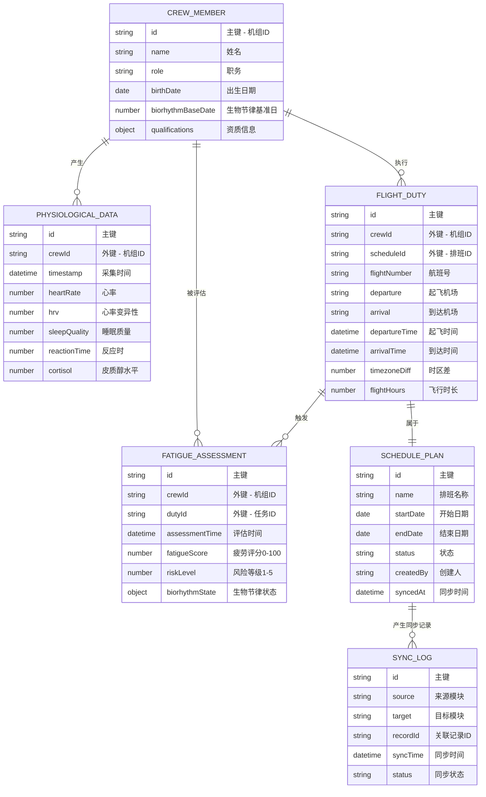

## 1. 架构设计

```mermaid
graph TD
    subgraph "前端展示层 (Vue 3 + TypeScript"
        A1["综合驾驶舱 Dashboard
        A2["航医中心 Medical
        A3["AOC运行控制 AOC
        A4["算法中心 Algorithm
        A5["工效学图谱库 Database
    end
    
    subgraph "状态管理层 (Pinia)"
        B1["全局状态 Store
        B2["生理指标 Store
        B3["排班数据 Store
        B4["疲劳评估 Store
    end
    
    subgraph "算法引擎层"
        C1["生物节律算法 Biorhythm
        C2["跨时区反应时模型 ReactionTime
        C3["异步反馈机制 AsyncFeedback
        C4["风险评级引擎 RiskEngine
    end
    
    subgraph "数据持久层 (IndexedDB)"
        D1["工效学图谱数据库
        D2["对象存储 ObjectStores
        D3["索引查询引擎 QueryEngine
    end
    
    subgraph "模拟数据层 (Mock)"
        E1["机组人员数据
        E2["航班排班数据
        E3["生理指标模拟
    end
    
    A1 --> B1
    A2 --> B2
    A3 --> B3
    A4 --> B4
    
    B1 --> C1
    B2 --> C2
    B3 --> C3
    B4 --> C4
    
    C1 --> D1
    C2 --> D2
    C3 --> D3
    C4 --> D1
    
    D1 --> E1
    D2 --> E2
    D3 --> E3
```

## 2. 技术栈说明

### 2.1 核心技术栈

| 层级 | 技术选型 | 版本 | 用途 |
|------|----------|------|------|
| 前端框架 | Vue 3 + TypeScript | 3.4+ | 响应式UI框架 |
| 构建工具 | Vite | 5.0+ | 快速构建与开发服务器 |
| 状态管理 | Pinia | 2.1+ | 全局状态管理 |
| 路由 | Vue Router | 4.3+ | 单页路由管理 |
| 图表可视化 | ECharts | 5.5+ | 专业数据可视化 |
| 数据库 | IndexedDB (idb) | 8.0+ | 浏览器端大容量存储 |
| 样式框架 | TailwindCSS | 3.4+ | 原子化CSS |
| UI组件 | PrimeVue | 3.5+ | 企业级UI组件库 |
| 图标 | Font Awesome | 6.5+ | 图标库 |
| 日期处理 | dayjs | 1.11+ | 时区与日期计算 |

### 2.2 关键技术决策

1. **IndexedDB 存储方案**：使用 `idb` 封装库封装原生IndexedDB，支持大容量机组工效学图谱长周期存储
2. **异步生物节律算法**：自研算法引擎独立于UI层，便于测试与复用
3. **模块化架构**：航医中心与AOC模块独立但通过状态同步
4. **响应式数据流**：单向数据流 + 事件总线实现跨模块同步

## 3. 路由定义

| 路由路径 | 页面名称 | 核心功能 |
|-----------|----------|----------|
| `/` | 综合驾驶舱 | 全局疲劳度概览、预警中心 |
| `/dashboard | Dashboard | KPI仪表盘、热力图、演化曲线 |
| `/medical` | 航医中心 | 生理指标监测与健康管理 |
| `/medical/monitoring` | 生理监测 | 实时生理指标波形展示 |
| `/medical/records` | 健康档案 | 机组人员健康档案管理 |
| `/aoc` | AOC运行控制 | 排班计划与航班管理 |
| `/aoc/schedule` | 排班管理 | 可视化排班日历 |
| `/aoc/network` | 航班网络 | 跨国航线图 |
| `/algorithm` | 算法中心 | 生物节律与疲劳评估 |
| `/algorithm/biorhythm` | 生物节律 | 三相节律曲线分析 |
| `/algorithm/fatigue` | 疲劳评估 | 排班疲劳仿真预测 |
| `/database` | 工效学图谱 | IndexedDB数据查询与分析 |

## 4. 数据模型设计

### 4.1 IndexedDB 对象存储设计



### 4.2 索引设计

| 对象存储 | 索引字段 | 索引类型 |
|----------|----------|----------|
| crewMember | crewId, name, role | 主键 + 复合索引 |
| physiologicalData | crewId, timestamp, crewId+timestamp | 多列索引 |
| flightDuty | crewId, scheduleId, departureTime | 复合索引 |
| fatigueAssessment | crewId, assessmentTime, riskLevel | 复合索引 |
| schedulePlan | startDate, endDate, status | 范围索引 |

## 5. 核心算法设计

### 5.1 生物节律算法 (Biorhythm)
```typescript
// 三相生物节律计算
interface BiorhythmResult {
  physical: number;     // 体力节律 (23天周期)
  emotional: number;    // 情绪节律 (28天周期)
  intellectual: number; // 智力节律 (33天周期)
  isCriticalDay: boolean;
}

function calculateBiorhythm(birthDate: Date, targetDate: Date): BiorhythmResult
```

### 5.2 跨时区反应时模型
```typescript
// 基于时区偏移、飞行时长、睡眠质量计算反应时衰减
interface ReactionTimePrediction {
  baselineReactionTime: number;  // 基线反应时(ms)
  predictedReactionTime: number;  // 预测反应时(ms)
  attenuationFactor: number;      // 衰减系数
  timezoneJetlag: number;     // 时差影响
}
```

### 5.3 异步反馈机制
```typescript
// 航医数据变化 -> 航医数据与AOC数据同步协议
interface SyncMessage {
  type: 'medical_update' | 'schedule_update' | 'fatigue_alert';
  payload: any;
  timestamp: Date;
  source: 'medical' | 'aoc' | 'algorithm';
}
```

### 5.4 风险评级引擎
```typescript
// 综合多维度疲劳风险评估
interface FatigueRisk {
  score: number;      // 0-100
  level: 'low' | 'medium' | 'high' | 'critical';
  contributingFactors: string[];
  recommendations: string[];
}
```

## 6. 项目目录结构

```
AviaFlow/
├── src/
│   ├── assets/              # 静态资源
│   │   ├── styles/          # 全局样式
│   │   └── icons/           # 图标资源
│   ├── components/          # 公共组件
│   │   ├── charts/       # 图表组件
│   │   ├── layout/       # 布局组件
│   │   └── ui/           # UI组件
│   ├── composables/       # 组合式函数
│   │   ├── useBiorhythm.ts
│   │   ├── useFatigueAssessment.ts
│   │   ├── useIndexedDB.ts
│   │   └── useSyncMechanism.ts
│   ├── database/          # IndexedDB层
│   │   ├── schema.ts
│   │   ├── stores/
│   │   │   ├── crewStore.ts
│   │   │   ├── physiologicalStore.ts
│   │   └── queryEngine.ts
│   ├── router/            # 路由配置
│   ├── stores/            # Pinia状态管理
│   │   ├── medical.ts
│   │   ├── aoc.ts
│   │   ├── dashboard.ts
│   │   └── sync.ts
│   ├── types/             # TypeScript类型定义
│   │   ├── crew.ts
│   │   ├── medical.ts
│   │   ├── schedule.ts
│   │   └── algorithm.ts
│   ├── utils/             # 工具函数
│   │   ├── biorhythm.ts
│   │   ├── timezone.ts
│   │   └── mock.ts
│   ├── views/             # 页面视图
│   │   ├── Dashboard/
│   │   ├── Medical/
│   │   ├── AOC/
│   │   ├── Algorithm/
│   │   └── Database/
│   ├── App.vue
│   └── main.ts
├── public/
├── package.json
├── tsconfig.json
├── vite.config.ts
├── tailwind.config.js
└── index.html
```

## 7. 初始化数据策略

1. 应用启动时自动初始化IndexedDB数据库
2. 自动生成模拟机组人员数据（20名机组成员）
3. 生成模拟生理指标历史数据（过去90天）
4. 生成模拟航班排班数据（未来30天）
5. 自动运行算法预计算历史疲劳评估数据
