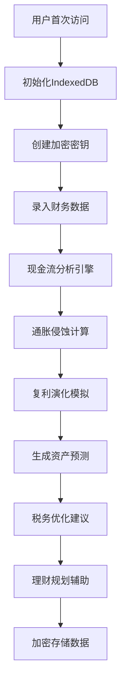

## 1. 产品概述

FinanceNexus 是一款面向个人用户的跨周期财务规划系统，融合记账、税务优化与理财辅助于一体，通过异步复利演化模拟引擎实现资产趋势预测，配合 IndexedDB 离线加密存储保障数据主权。

- 核心价值：帮助用户实现全生命周期的财务健康管理，从日常记账到长期资产规划，提供科学的财务决策支持。

## 2. 核心功能

### 2.1 用户角色
| 角色 | 注册方式 | 核心权限 |
|------|----------|----------|
| 个人用户 | 本地匿名/在线注册 | 完整使用所有功能，数据本地加密存储 |

### 2.2 功能模块
1. **仪表盘**：资产概览、现金流趋势、通胀侵蚀分析、资产预测可视化
2. **记账系统**：收支记录、分类管理、批量导入、标签系统
3. **税务辅助**：个税计算、专项附加扣除、税务优化建议
4. **理财规划**：资产配置、风险评估、投资组合建议
5. **复利模拟器**：异步复利演化、跨周期模拟、通胀影响分析
6. **数据中心**：数据备份/恢复、导出、加密管理

### 2.3 页面详情
| 页面名称 | 模块名称 | 功能描述 |
|-----------|----------|----------|
| 仪表盘 | 资产总览卡片 | 净资产、月度收支、资产增长率实时展示 |
| 仪表盘 | 现金流趋势图 | 多时间维度收支曲线，支持同比环比分析 |
| 仪表盘 | 通胀侵蚀分析 | 展示货币购买力随时间衰减的可视化 |
| 仪表盘 | 资产预测图表 | 复利演化模拟结果的3D趋势图 |
| 记账页面 | 交易记录列表 | 支持筛选、搜索、批量操作 |
| 记账页面 | 快速记账表单 | 分类选择、金额输入、标签管理 |
| 税务页面 | 个税计算器 | 收入输入、专项扣除、税额计算 |
| 税务页面 | 税务优化建议 | 基于用户数据的节税策略 |
| 理财页面 | 资产配置雷达 | 各类资产占比可视化 |
| 理财页面 | 风险评估问卷 | 动态风险测评与建议 |
| 复利模拟器 | 参数配置 | 本金、利率、周期、通胀率设置 |
| 复利模拟器 | 演化模拟 | 异步计算多种情景下的资产演化 |
| 设置页面 | 数据管理 | 导出/导入、备份恢复 |
| 设置页面 | 加密设置 | 加密密钥管理、数据安全选项 |

## 3. 核心流程

用户首次访问 → 初始化本地数据库 → 创建加密密钥 → 录入基础财务数据 → 系统自动进行现金流分析 → 生成资产预测模型 → 用户可进行税务计算与理财规划 → 数据实时同步至 IndexedDB 加密存储

## 4. 用户界面设计

### 4.1 设计风格
- **主色调**：深邃藏蓝 (#0F172A) 搭配 科技青绿 (#10B981)
- **辅助色**：琥珀金 (#F59E0B)、预警红 (#EF4444)
- **按钮风格**：圆角8px，微悬浮效果，渐变边框
- **字体**：Space Grotesk (标题) + JetBrains Mono (数据展示)
- **布局风格**：玻璃拟态卡片、毛玻璃背景、深度阴影
- **图标风格**：线性图标，统一2px描边

### 4.2 页面设计概述
| 页面名称 | 模块名称 | UI元素 |
|-----------|----------|--------|
| 仪表盘 | 资产总览 | 玻璃拟态卡片、动态数字、趋势箭头 |
| 仪表盘 | 图表区域 | Recharts 面积图、柱状图 |
| 记账页 | 交易列表 | 斑马纹行、悬停高亮、分类徽章 |
| 税务页 | 计算器 | 表单输入、实时计算、建议卡片 |
| 理财页 | 资产雷达 | 雷达图、配置滑块、对比分析 |
| 模拟器 | 参数面板 | 滑块控制、多情景标签、3D图表 |

### 4.3 响应性
- 桌面端优先设计，自适应到平板与移动端
- 侧边栏在移动端转为底部导航
- 图表区域支持触控缩放
- 表单元素触控优化

### 4.4 动效设计
- 页面加载：错落入场动画
- 数字变化：平滑数字滚动
- 图表渲染：渐进式绘制动画
- 卡片悬浮：微妙缩放+光晕效果
