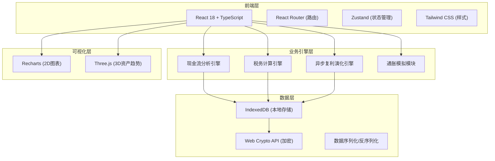
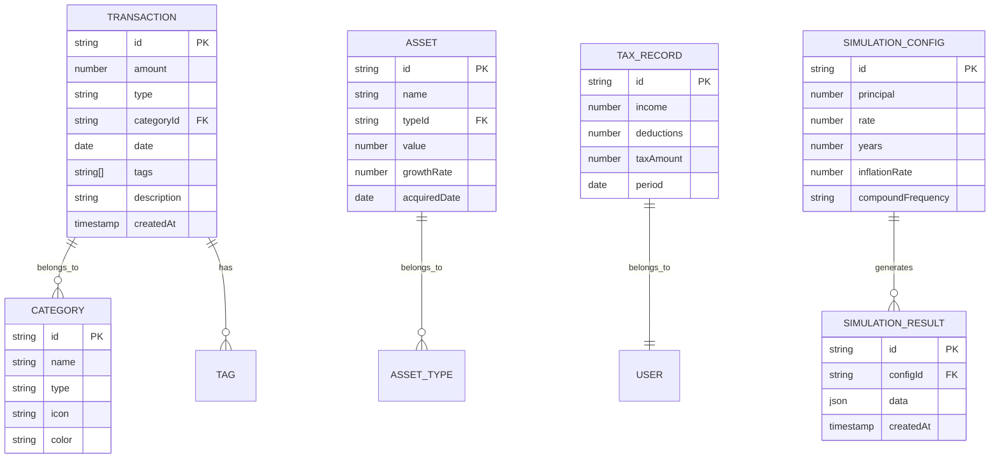

## 1. 架构设计

## 2. 技术说明

- **前端框架**: React@18 + TypeScript + Vite
- **状态管理**: Zustand
- **路由**: React Router DOM@6
- **样式**: Tailwind CSS@3 + Framer Motion
- **图表**: Recharts + @react-three/fiber + @react-three/drei
- **数据存储**: IndexedDB (idb 封装)
- **加密**: Web Crypto API (AES-GCM)
- **图标**: Lucide React

## 3. 路由定义

| 路由 | 页面 | 用途 |
|------|------|------|
| / | Dashboard 仪表盘 | 资产总览、趋势图表、预测分析 |
| /transactions | Transactions 记账 | 交易记录管理、快速记账 |
| /tax | Tax 税务 | 个税计算、优化建议 |
| /investments | Investments 理财 | 资产配置、风险评估 |
| /simulator | Simulator 模拟器 | 复利演化、跨周期模拟 |
| /settings | Settings 设置 | 数据管理、加密设置 |

## 4. 数据模型

### 4.1 数据模型定义

### 4.2 IndexedDB Store 结构

| Store Name | Key Path | 索引 |
|------------|----------|------|
| transactions | id | date, categoryId, type |
| categories | id | type |
| assets | id | typeId |
| taxRecords | id | period |
| simulationConfigs | id | createdAt |
| simulationResults | id | configId |
| settings | key | - |
| encryptionMeta | id | - |

## 5. 核心引擎模块

### 5.1 现金流分析引擎
- 输入：交易记录数组
- 输出：月度/季度/年度收支统计、净现金流、趋势预测
- 特点：支持多维度聚合、同比环比计算

### 5.2 税务计算引擎
- 支持中国个人所得税计算
- 专项附加扣除管理
- 年终奖优化计算
- 税务筹划建议生成

### 5.3 异步复利演化引擎
- Web Worker 后台计算
- 支持多情景并行模拟
- 蒙特卡洛模拟风险分析
- 通胀因素自动折算

### 5.4 加密模块
- AES-GCM 数据加密
- PBKDF2 密钥派生
- 支持用户密码保护
- 数据导出时自动加密
