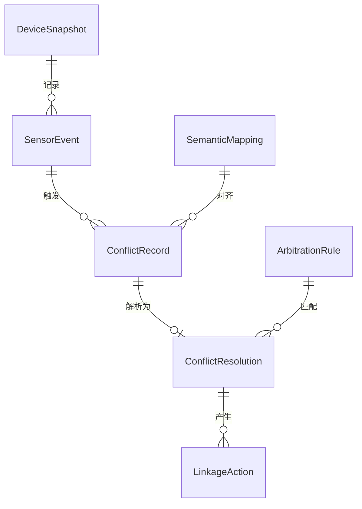

## 1. 架构设计

```mermaid
graph TB
    subgraph "前端展示层"
        "Vue 3 应用" --> "Pinia 状态管理"
        "Vue 3 应用" --> "Vue Router 路由"
        "Vue 3 应用" --> "组件库"
    end
    
    subgraph "核心引擎层"
        "语义对齐引擎" --> "冲突检测器"
        "冲突检测器" --> "异步冲突队列"
        "异步冲突队列" --> "仲裁规则引擎"
        "仲裁规则引擎" --> "联动执行器"
        "联动执行器" --> "闭环追踪器"
    end
    
    subgraph "数据持久层"
        "IndexedDB 存储引擎" --> "设备快照库"
        "IndexedDB 存储引擎" --> "规则配置库"
        "IndexedDB 存储引擎" --> "冲突日志库"
        "IndexedDB 存储引擎" --> "语义映射库"
    end
    
    subgraph "模拟数据层"
        "传感器模拟器" --> "安防系统模拟"
        "传感器模拟器" --> "家居控制模拟"
    end
    
    "传感器模拟器" --> "语义对齐引擎"
    "联动执行器" --> "IndexedDB 存储引擎"
    "闭环追踪器" --> "Vue 3 应用"
    "Pinia 状态管理" --> "Vue 3 应用"
```

## 2. 技术说明

- **前端框架**：Vue 3 + TypeScript + Vite
- **初始化工具**：create-vue (Vite)
- **状态管理**：Pinia
- **路由**：Vue Router 4
- **样式方案**：Tailwind CSS 4 + 自定义 CSS 变量
- **图表库**：Chart.js + chartjs-plugin-streaming（实时数据流）
- **图标**：Lucide Icons（Vue 版）
- **数据库**：IndexedDB（通过 idb 库封装）
- **后端**：无后端，纯前端应用，使用模拟数据生成器
- **动画**：CSS Animations + Vue Transition

## 3. 路由定义

| 路由 | 用途 |
|------|------|
| / | 重定向至 /dashboard |
| /dashboard | 实时监控仪表盘 |
| /conflict | 冲突解析中心 |
| /snapshot | 设备快照管理 |
| /rules | 规则引擎配置 |

## 4. API 定义

本项目为纯前端应用，无后端 API。数据通过以下方式获取：

- **模拟数据生成器**：SensorSimulator 类，定时生成传感器触发事件
- **IndexedDB 接口**：封装为 Repository 模式，提供 CRUD 操作

### 4.1 核心 TypeScript 类型

```typescript
interface SensorEvent {
  id: string
  sensorId: string
  type: 'security' | 'comfort' | 'energy' | 'safety'
  value: number
  unit: string
  timestamp: number
  source: 'security_system' | 'home_control'
}

interface ConflictRecord {
  id: string
  events: SensorEvent[]
  type: 'priority' | 'semantic' | 'timing' | 'resource'
  severity: 'low' | 'medium' | 'high' | 'critical'
  status: 'pending' | 'resolving' | 'resolved' | 'escalated'
  resolution?: ConflictResolution
  createdAt: number
  resolvedAt?: number
}

interface ConflictResolution {
  strategy: 'priority_override' | 'merge' | 'defer' | 'conditional'
  winner: string
  actions: LinkageAction[]
  reasoning: string
}

interface LinkageAction {
  id: string
  deviceId: string
  action: string
  params: Record<string, unknown>
  status: 'pending' | 'executing' | 'completed' | 'failed'
  timestamp: number
}

interface DeviceSnapshot {
  id: string
  deviceId: string
  deviceName: string
  room: string
  type: string
  state: Record<string, unknown>
  timestamp: number
  triggerEvent?: string
}

interface SemanticMapping {
  id: string
  securityTerm: string
  homeControlTerm: string
  unifiedSemantics: string
  category: string
  priorityWeight: number
}

interface ArbitrationRule {
  id: string
  name: string
  condition: RuleCondition
  strategy: ConflictResolution['strategy']
  priority: number
  enabled: boolean
}

interface RuleCondition {
  field: string
  operator: 'eq' | 'neq' | 'gt' | 'lt' | 'contains' | 'in'
  value: unknown
}
```

## 5. 服务器架构

无后端服务器，纯前端应用。

## 6. 数据模型

### 6.1 数据模型定义



### 6.2 IndexedDB 数据库定义

- **数据库名称**：HomeAutoPulseDB
- **版本**：1

| 存储名称 | 键路径 | 索引 |
|----------|--------|------|
| snapshots | id | deviceId, timestamp, room |
| conflicts | id | status, severity, createdAt |
| rules | id | enabled, priority |
| semanticMappings | id | category |
| sensorEvents | id | sensorId, type, timestamp, source |
| linkageActions | id | deviceId, status, timestamp |
