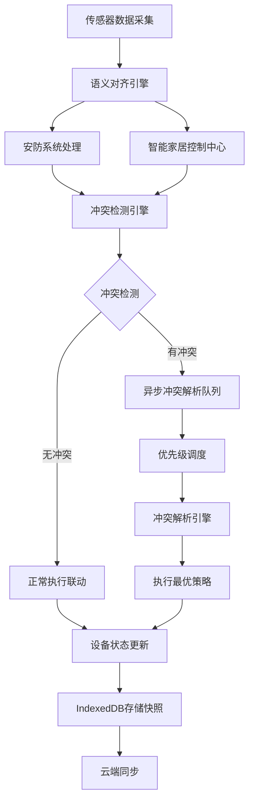

## 1. 产品概述

家庭自动化逻辑冲突监控系统，实现多维度传感器数据在安防系统与智能家居控制中心间的语义对齐，通过异步冲突解析引擎优化设备联动闭环，利用IndexedDB存储智能设备离线工况快照，保障复杂场景下全屋智能的逻辑可靠性。

- 解决智能家居设备间的逻辑冲突问题，避免安防系统与舒适系统的指令矛盾
- 目标用户：家庭用户、智能家居运维人员、系统集成商
- 核心价值：提升全屋智能系统的可靠性、降低误操作风险、保障家庭安全

## 2. 核心功能

### 2.1 用户角色
| 角色 | 注册方式 | 核心权限 |
|------|----------|----------|
| 家庭管理员 | 本地账号注册 | 设备配置、冲突规则管理、系统监控、数据导出 |
| 运维人员 | 授权登录 | 冲突诊断、系统优化、日志分析 |
| 普通用户 | 家庭成员邀请 | 设备状态查看、冲突通知接收 |

### 2.2 功能模块
1. **监控仪表盘**：实时冲突监控、设备状态概览、系统健康度评分
2. **冲突解析中心**：冲突检测、冲突详情、异步解析队列、冲突历史记录
3. **传感器语义对齐**：多源数据融合、语义映射配置、安防/家居场景切换
4. **设备工况快照**：IndexedDB离线存储、快照管理、数据同步状态
5. **规则引擎配置**：冲突规则定义、优先级设置、联动逻辑编辑

### 2.3 页面详情
| 页面名称 | 模块名称 | 功能描述 |
|-----------|-------------|---------------------|
| 监控仪表盘 | 实时冲突看板 | 实时显示当前冲突数量、类型、严重程度，支持动态刷新 |
| 监控仪表盘 | 设备状态矩阵 | 网格展示所有设备在线/离线状态、最近活动时间 |
| 监控仪表盘 | 系统健康度 | 基于冲突率、响应时延等指标的综合评分 |
| 冲突解析中心 | 冲突列表 | 分页展示所有冲突记录，支持按类型、状态、时间筛选 |
| 冲突解析中心 | 冲突详情 | 展示冲突涉及设备、触发源、冲突原因、解析建议 |
| 冲突解析中心 | 异步解析队列 | 显示待解析、解析中、已解析任务队列及进度 |
| 语义对齐配置 | 传感器映射 | 配置传感器类型与安防/家居场景的语义映射关系 |
| 语义对齐配置 | 场景管理 | 定义离家、回家、睡眠、安防等场景的语义规则 |
| 设备快照管理 | 快照列表 | 浏览IndexedDB存储的设备离线工况快照 |
| 设备快照管理 | 快照详情 | 查看快照时间戳、设备状态、触发条件等详细数据 |
| 设备快照管理 | 同步状态 | 显示离线数据与云端的同步进度及状态 |
| 规则配置 | 规则列表 | 管理冲突检测规则、优先级、响应策略 |
| 规则配置 | 规则编辑器 | 可视化编辑联动规则、冲突条件、执行动作 |

## 3. 核心流程

传感器数据采集 → 语义对齐引擎统一数据格式 → 安防系统与家居控制中心并行处理 → 冲突检测引擎识别逻辑矛盾 → 异步冲突解析队列调度 → 冲突解决策略执行 → 设备状态更新 → IndexedDB持久化工况快照 → 同步至云端

## 4. 用户界面设计

### 4.1 设计风格
- **主色调**：深空蓝 (#0A1628) 作为背景，科技感十足
- **辅助色**：警戒橙 (#FF6B35) 表示冲突警告，安全绿 (#00C853) 表示正常状态，信息蓝 (#2196F3) 表示系统信息
- **高亮色**：霓虹紫 (#7C4DFF) 用于强调关键数据和交互元素
- **字体**：展示字体使用 Space Grotesk，正文字体使用 JetBrains Mono，营造工业科技感
- **布局**：深色主题仪表盘布局，采用不对称网格布局，信息密度适中
- **图标风格**：线性简约图标，配合发光效果增强科技感

### 4.2 页面设计概述
| 页面名称 | 模块名称 | UI元素 |
|-----------|-------------|-------------|
| 监控仪表盘 | 冲突看板 | 大号数字显示、脉冲动画、渐变进度条、实时折线图 |
| 监控仪表盘 | 设备矩阵 | 卡片式网格、状态指示灯、悬停详情、过渡动画 |
| 监控仪表盘 | 健康度 | 环形进度条、趋势箭头、评分刻度、粒子背景效果 |
| 冲突解析中心 | 冲突列表 | 斑马纹表格、状态标签、优先级标识、展开/收起动画 |
| 冲突解析中心 | 解析队列 | 时间线布局、进度条、任务状态流转、拖拽重排 |
| 语义对齐配置 | 映射关系 | 双向连线图、拖拽配置、语义标签、类型筛选 |
| 设备快照管理 | 快照时间线 | 垂直时间轴、快照卡片、同步状态指示、离线标识 |
| 规则配置 | 规则编辑器 | 节点连线编辑器、条件积木块、动作面板、实时预览 |

### 4.3 响应性
- **桌面端**：1920px优先，侧边导航+多栏布局，充分利用大屏空间
- **平板端**：1024px适配，顶部导航+双栏布局，优化触控区域
- **移动端**：768px以下，汉堡菜单+单列布局，核心信息优先展示

### 4.4 动效设计
- **页面加载**：元素从下往上渐入，错开延迟形成瀑布流效果
- **数据更新**：数字滚动动画、数值变化高亮闪烁
- **状态切换**：平滑过渡动画、滑块位移效果
- **悬停交互**：微放大效果、背景加深、边框发光
- **告警效果**：脉冲呼吸动画、颜色渐变、轻微震动
