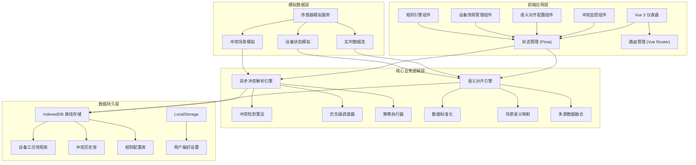
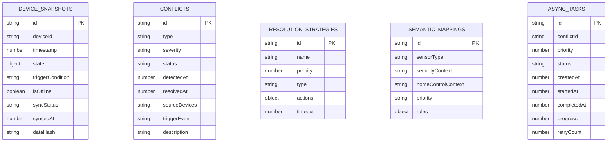

## 1. 架构设计



## 2. 技术描述

- **前端框架**：Vue 3.4 + TypeScript 5.4 + Vite 5.2
- **状态管理**：Pinia 2.1
- **路由管理**：Vue Router 4.3
- **样式方案**：TailwindCSS 3.4 + SCSS
- **图表可视化**：ECharts 5.5
- **图标库**：Lucide Vue Next
- **IndexedDB封装**：idb 8.0
- **日期处理**：dayjs 1.11
- **动画库**：@vueuse/motion 2.1

## 3. 路由定义

| 路由 | 页面组件 | 功能描述 |
|-------|---------|----------|
| / | Dashboard | 系统总览仪表盘，实时监控冲突状态 |
| /conflicts | ConflictCenter | 冲突解析中心，展示冲突列表和解析队列 |
| /conflicts/:id | ConflictDetail | 冲突详情页，查看完整冲突信息 |
| /semantic | SemanticAlignment | 语义对齐配置，管理传感器映射规则 |
| /snapshots | SnapshotManager | 设备快照管理，浏览离线工况数据 |
| /rules | RuleEngine | 规则引擎配置，定义冲突检测和响应策略 |
| /devices | DeviceList | 设备列表，管理所有接入的智能设备 |
| /settings | SystemSettings | 系统设置页面 |

## 4. 核心数据模型

### 4.1 TypeScript 类型定义

```typescript
// 传感器数据类型
interface SensorData {
  id: string;
  deviceId: string;
  sensorType: 'motion' | 'door' | 'window' | 'temperature' | 'humidity' | 'light' | 'smoke' | 'water' | 'gas';
  value: number | boolean;
  unit: string;
  timestamp: number;
  location: string;
  semanticTags: string[];
}

// 设备状态类型
interface Device {
  id: string;
  name: string;
  type: 'security' | 'comfort' | 'entertainment' | 'energy';
  category: string;
  status: 'online' | 'offline' | 'error' | 'syncing';
  currentState: Record<string, any>;
  location: string;
  lastActivity: number;
  systemAffiliation: 'security' | 'homeControl' | 'both';
}

// 冲突类型
interface Conflict {
  id: string;
  type: 'security_vs_comfort' | 'energy_vs_comfort' | 'scene_conflict' | 'rule_contradiction';
  severity: 'critical' | 'high' | 'medium' | 'low';
  status: 'detected' | 'pending' | 'resolving' | 'resolved' | 'ignored';
  detectedAt: number;
  resolvedAt?: number;
  sourceDevices: string[];
  targetDevices: string[];
  triggerEvent: string;
  description: string;
  resolutionStrategy?: ResolutionStrategy;
  resolutionHistory: ResolutionStep[];
}

// 解析策略
interface ResolutionStrategy {
  id: string;
  name: string;
  priority: number;
  type: 'security_first' | 'comfort_first' | 'energy_first' | 'manual' | 'custom';
  actions: ResolutionAction[];
  timeout: number;
}

// 解析动作
interface ResolutionAction {
  id: string;
  deviceId: string;
  actionType: 'set_state' | 'delay' | 'notify' | 'suspend_rule';
  parameters: Record<string, any>;
  status: 'pending' | 'executing' | 'completed' | 'failed';
}

// 设备工况快照
interface DeviceSnapshot {
  id: string;
  deviceId: string;
  timestamp: number;
  state: Record<string, any>;
  triggerCondition: string;
  isOffline: boolean;
  syncStatus: 'pending' | 'synced' | 'failed';
  syncedAt?: number;
  dataHash: string;
}

// 语义映射
interface SemanticMapping {
  id: string;
  sensorType: string;
  securityContext: string;
  homeControlContext: string;
  priority: 'security' | 'homeControl' | 'context_aware';
  rules: SemanticRule[];
}

// 语义规则
interface SemanticRule {
  id: string;
  condition: string;
  securityAction: string;
  homeControlAction: string;
  conflictResolution: string;
}

// 异步解析任务
interface AsyncTask {
  id: string;
  conflictId: string;
  priority: number;
  status: 'queued' | 'processing' | 'completed' | 'failed';
  createdAt: number;
  startedAt?: number;
  completedAt?: number;
  progress: number;
  retryCount: number;
  error?: string;
}
```

### 4.2 IndexedDB 数据模型



## 5. 核心模块设计

### 5.1 异步冲突解析引擎

采用队列+优先级调度模式，确保高优先级冲突优先处理：

```typescript
// 核心流程
class ConflictResolutionEngine {
  private taskQueue: PriorityQueue<AsyncTask>;
  private activeWorkers: number = 0;
  private maxWorkers: number = 3;
  
  async enqueueConflict(conflict: Conflict): Promise<AsyncTask>;
  private async processTask(task: AsyncTask): Promise<void>;
  private async executeStrategy(strategy: ResolutionStrategy): Promise<boolean>;
  private async notifyUser(conflict: Conflict): Promise<void>;
}
```

### 5.2 语义对齐模块

多源传感器数据标准化与场景语义映射：

```typescript
class SemanticAlignmentEngine {
  private mappings: SemanticMapping[];
  
  alignSensorData(data: SensorData, context: 'security' | 'homeControl' | 'both'): AlignedData;
  fuseMultiSourceData(dataPoints: SensorData[]): FusedData;
  detectContextSwitch(current: string, target: string): ContextTransition;
  resolveSemanticAmbiguity(data: SensorData): ResolvedSemantics;
}
```

### 5.3 IndexedDB 离线存储模块

封装IndexedDB操作，提供离线数据持久化能力：

```typescript
class OfflineSnapshotStore {
  private db: IDBPDatabase;
  
  async saveSnapshot(snapshot: DeviceSnapshot): Promise<void>;
  async getSnapshots(deviceId?: string, limit?: number): Promise<DeviceSnapshot[]>;
  async getPendingSyncCount(): Promise<number>;
  async syncToCloud(): Promise<SyncResult>;
  async cleanupOldData(retentionDays: number): Promise<void>;
}
```

## 6. 目录结构

```
src/
├── assets/              # 静态资源
├── components/          # 通用组件
│   ├── dashboard/       # 仪表盘组件
│   ├── conflicts/       # 冲突相关组件
│   ├── semantic/        # 语义对齐组件
│   ├── snapshots/       # 快照管理组件
│   ├── rules/           # 规则引擎组件
│   └── common/          # 通用UI组件
├── composables/         # 组合式函数
│   ├── useConflictEngine.ts
│   ├── useSemanticAlignment.ts
│   ├── useOfflineStorage.ts
│   ├── useSensorSimulation.ts
│   └── useAsyncQueue.ts
├── stores/              # Pinia状态管理
│   ├── deviceStore.ts
│   ├── conflictStore.ts
│   ├── snapshotStore.ts
│   └── semanticStore.ts
├── pages/               # 页面组件
│   ├── Dashboard.vue
│   ├── ConflictCenter.vue
│   ├── ConflictDetail.vue
│   ├── SemanticAlignment.vue
│   ├── SnapshotManager.vue
│   ├── RuleEngine.vue
│   ├── DeviceList.vue
│   └── SystemSettings.vue
├── utils/               # 工具函数
│   ├── indexedDB.ts
│   ├── semanticUtils.ts
│   ├── conflictUtils.ts
│   ├── dateUtils.ts
│   └── mockData.ts
├── types/               # TypeScript类型定义
│   ├── device.ts
│   ├── conflict.ts
│   ├── snapshot.ts
│   └── semantic.ts
├── router/              # 路由配置
│   └── index.ts
├── App.vue
└── main.ts
```
