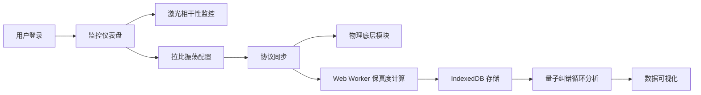

## 1. 产品概述

量子门量子相干性监控系统 - 基于 SolidJS 构建的离子阱量子计算机监控平台，实时监控激光相干性演变，实现拉比振荡概率模型的协议同步，支撑跨系统量子相干态的逻辑严密性。

- **核心目标**: 为量子计算研究人员提供高精度的激光相干性监控、量子门保真度计算与量子纠错数据存储平台
- **目标用户**: 量子计算研究员、量子系统工程师、量子算法开发人员
- **技术价值**: 实现量子计算硬件层与控制层的高效数据同步与可视化分析

## 2. 核心功能

### 2.1 用户角色

| 角色 | 登录方式 | 核心权限 |
|------|----------|----------|
| 研究员 | 本地认证 | 实时监控、数据查询、模型分析、系统配置 |
| 管理员 | 管理员密码 | 用户管理、系统设置、数据导出 |

### 2.2 功能模块

1. **监控仪表盘**: 激光相干性实时监控、量子比特状态概览、系统状态指标
2. **拉比振荡模块**: 概率模型可视化、参数配置、协议同步控制
3. **保真度计算模块**: 量子逻辑门保真度计算、Web Worker 异步处理、结果展示
4. **量子纠错模块**: 校验子快照存储、纠错循环监控、IndexedDB 数据管理
5. **协议同步模块**: 控制台与物理底层通信、数据同步状态监控

### 2.3 页面详情

| 页面名称 | 模块名称 | 功能描述 |
|-----------|-------------|---------------------|
| 监控仪表盘 | 实时监控区 | 激光相干性演变曲线图、量子比特状态阵列、系统健康指标 |
| 拉比振荡 | 概率模型 | 拉比振荡概率分布可视化、参数调节控件、协议同步状态 |
| 保真度计算 | 计算面板 | 量子门选择、参数配置、异步计算进度、结果对比图表 |
| 量子纠错 | 数据管理 | 纠错循环列表、校验子快照查询、IndexedDB 存储状态 |
| 系统设置 | 配置面板 | 物理底层连接配置、数据存储策略、同步协议参数 |

## 3. 核心流程

用户登录系统后，首先在监控仪表盘查看激光相干性实时数据。可进入拉比振荡模块配置参数并启动协议同步，同步数据触发 Web Worker 进行量子门保真度异步计算。计算结果与量子纠错校验子快照自动存入 IndexedDB，支持历史数据回溯与分析。

## 4. 用户界面设计

### 4.1 设计风格

- **主色调**: 深空蓝 (#0A1628) 配合量子青 (#00D4FF) 强调色，营造科技感
- **辅助色**: 能量橙 (#FF6B35) 表示警告状态，稳定绿 (#39FF14) 表示正常
- **字体**: 采用 JetBrains Mono 等宽字体作为代码和数据展示，搭配 Space Grotesk 作为标题
- **布局风格**: 深色科技风，多面板信息密度布局，玻璃拟态卡片，网格背景
- **视觉效果**: 发光边框、扫描线动画、数据流动效果、全息感粒子背景
- **按钮风格**: 直角轻微圆角，霓虹发光效果，点击涟漪动画

### 4.2 页面设计概览

| 页面名称 | 模块名称 | UI 元素 |
|-----------|-------------|-------------|
| 监控仪表盘 | 实时监控区 | 动态曲线图、状态指示灯阵列、实时数据矩阵、粒子背景 |
| 拉比振荡 | 概率模型 | 3D 概率分布曲面图、滑动条控制器、同步进度条、波形动画 |
| 保真度计算 | 计算面板 | 量子门选择器、参数输入组、计算进度环、对比柱状图 |
| 量子纠错 | 数据管理 | 时间轴列表、快照网格、存储使用率、搜索过滤面板 |
| 系统设置 | 配置面板 | 表单分组、开关切换、连接状态指示器、保存按钮组 |

### 4.3 响应式设计

- 桌面端优先，支持 1920px+ 宽屏显示
- 三栏布局自适应收缩，小屏幕转为两栏或单栏堆叠
- 触控设备优化按钮尺寸与手势操作
- 图表组件支持触摸缩放与平移

### 4.4 视觉动效

- 页面加载：元素淡入 + 位移动画，按区块延迟 50ms 依次出现
- 数据更新：数值变化平滑过渡，图表曲线动态绘制
- 激光相干性：扫描线效果，脉冲发光动画
- 量子状态：概率云粒子效果，量子叠加态波动
