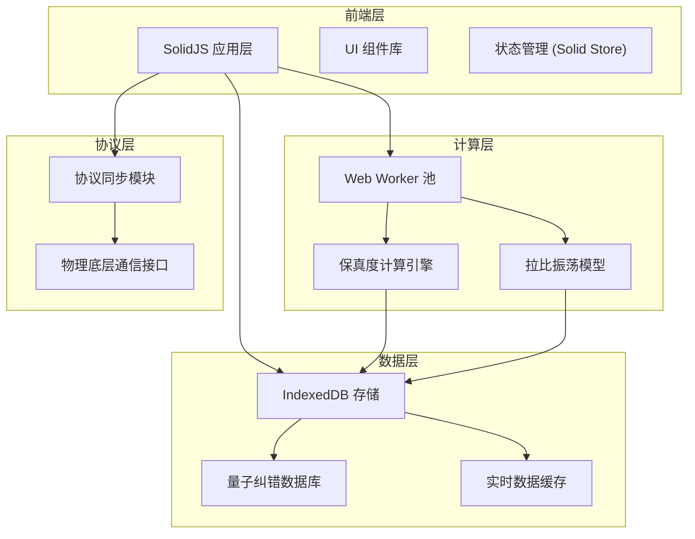
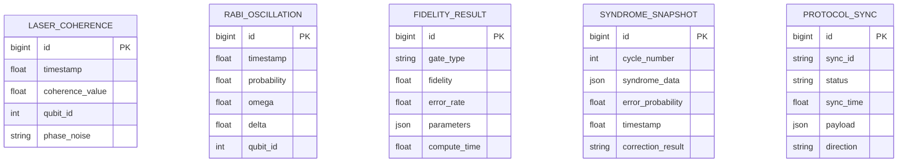
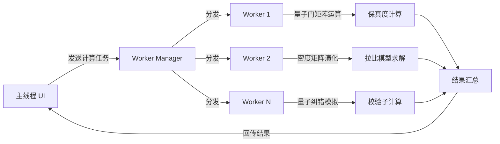

## 1. 架构设计



## 2. 技术描述

- **前端框架**: SolidJS 1.8 + TypeScript 5.3
- **构建工具**: Vite 5.0
- **样式方案**: TailwindCSS 3.4 + CSS 变量
- **图表库**: Chart.js 4.4 + 自定义 Canvas 渲染
- **状态管理**: SolidJS Stores 原生状态管理
- **Web Worker**: 原生 Web Worker API + Comlink
- **数据存储**: IndexedDB (idb 封装库)
- **路由**: @solidjs/router 0.13
- **字体**: Google Fonts (JetBrains Mono, Space Grotesk)

## 3. 路由定义

| 路由 | 页面名称 | 用途 |
|-------|---------|------|
| /dashboard | 监控仪表盘 | 激光相干性实时监控与系统概览 |
| /rabi-oscillation | 拉比振荡 | 概率模型配置与协议同步控制 |
| /fidelity | 保真度计算 | 量子逻辑门保真度异步计算面板 |
| /error-correction | 量子纠错 | 校验子快照管理与纠错循环分析 |
| /settings | 系统设置 | 物理底层连接与系统参数配置 |

## 4. 数据模型

### 4.1 数据模型定义



### 4.2 IndexedDB Store 定义

```typescript
interface DBSchema {
  laserCoherence: {
    key: number;
    value: LaserCoherenceRecord;
    indexes: { 'by-timestamp': number; 'by-qubit': number };
  };
  rabiOscillation: {
    key: number;
    value: RabiOscillationRecord;
    indexes: { 'by-timestamp': number };
  };
  fidelityResults: {
    key: number;
    value: FidelityResult;
    indexes: { 'by-gate-type': string };
  };
  syndromeSnapshots: {
    key: number;
    value: SyndromeSnapshot;
    indexes: { 'by-cycle': number; 'by-timestamp': number };
  };
  protocolSync: {
    key: number;
    value: ProtocolSyncRecord;
    indexes: { 'by-sync-id': string };
  };
}
```

## 5. Web Worker 架构



## 6. 核心模块接口定义

### 6.1 协议同步模块

```typescript
interface ProtocolSyncService {
  connect(endpoint: string): Promise<boolean>;
  disconnect(): void;
  sync(payload: SyncPayload): Promise<SyncResult>;
  onSync(callback: (data: SyncData) => void): () => void;
  getStatus(): SyncStatus;
}
```

### 6.2 保真度计算接口

```typescript
interface FidelityCalculator {
  calculateGateFidelity(
    gateType: QuantumGate,
    params: GateParams
  ): Promise<FidelityResult>;
  calculateAverageFidelity(
    gates: QuantumGate[],
    iterations: number
  ): Promise<FidelityReport>;
}
```

### 6.3 量子纠错存储接口

```typescript
interface SyndromeStore {
  saveSnapshot(snapshot: SyndromeSnapshot): Promise<number>;
  getSnapshotsByCycle(cycle: number): Promise<SyndromeSnapshot[]>;
  getSnapshotsInRange(start: number, end: number): Promise<SyndromeSnapshot[]>;
  countSnapshots(): Promise<number>;
  clearOldSnapshots(before: Date): Promise<number>;
}
```
