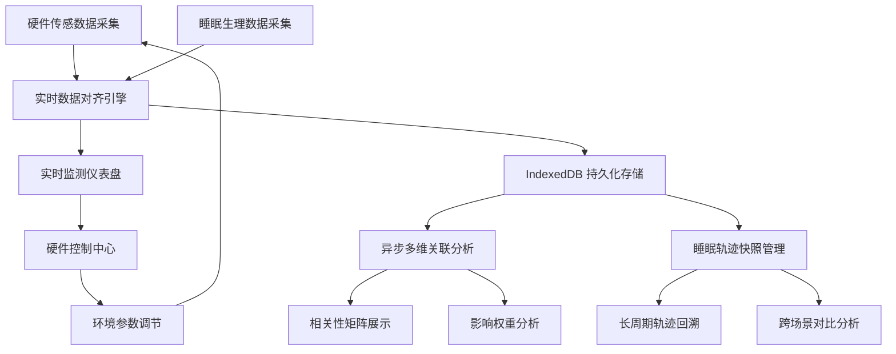

# SleepMatrix - 睡眠环境质量相关性分析系统 PRD

## 1. 产品概述

SleepMatrix 是一款基于 SolidJS 构建的睡眠环境质量数字化协同平台，通过光、温、噪多维传感数据与睡眠生理深度的实时对齐分析，揭示环境因素与睡眠质量的深层关联，支撑跨场景睡眠健康的数字化管理与优化决策。

- **核心价值**：打通硬件控制与监测系统的数据壁垒，实现睡眠环境参数与生理指标的多维关联分析
- **目标用户**：睡眠健康研究者、智能家居开发者、个人睡眠质量优化用户
- **市场定位**：专业级睡眠环境分析与数字化协同工具

## 2. 核心功能

### 2.1 用户角色

| 角色 | 注册方式 | 核心权限 |
|------|----------|----------|
| 普通用户 | 本地账户 | 查看睡眠数据、分析报告、环境参数控制 |
| 高级用户 | 本地账户升级 | 深度关联分析、长周期轨迹回溯、批量数据导出 |

### 2.2 功能模块

1. **实时监测仪表盘**：环境传感数据实时展示、睡眠生理深度可视化、硬件状态监控
2. **多维关联分析引擎**：异步计算光/温/噪与睡眠深度的相关性、热力图谱展示、影响权重排序
3. **睡眠轨迹快照**：IndexedDB 长周期存储、跨场景轨迹对比、快照时间轴浏览
4. **硬件控制中心**：环境参数调节、预设场景切换、控制策略配置
5. **数据管理中心**：数据导入导出、存储配额管理、历史数据清理

### 2.3 页面详情

| 页面名称 | 模块名称 | 功能描述 |
|-----------|-------------|---------------------|
| 实时监测页 | 环境数据卡片 | 光照强度、环境温度、噪音水平实时数值与趋势图 |
| 实时监测页 | 睡眠深度波形 | 多阶段睡眠深度实时曲线与阶段标识 |
| 实时监测页 | 硬件状态面板 | 传感器连接状态、控制设备在线状态 |
| 关联分析页 | 相关性矩阵 | 多维参数 Pearson/Spearman 相关系数热力图 |
| 关联分析页 | 影响权重分析 | 环境因素对睡眠质量贡献度排序与可视化 |
| 关联分析页 | 时间偏移分析 | 环境变化与睡眠响应的延迟效应分析 |
| 睡眠轨迹页 | 时间轴浏览 | 按日/周/月维度的睡眠轨迹快照浏览 |
| 睡眠轨迹页 | 场景对比 | 多场景睡眠数据并排对比分析 |
| 硬件控制页 | 参数调节器 | 光照、温度、白噪音等环境参数滑动控制 |
| 硬件控制页 | 场景模式 | 预设睡眠场景一键切换（深度睡眠/快速入睡/午休模式） |
| 数据管理页 | 存储概览 | IndexedDB 存储用量统计与配额管理 |
| 数据管理页 | 数据导入导出 | JSON/CSV 格式批量导入导出 |

## 3. 核心流程

### 3.1 主流程描述

用户进入系统后，首先查看实时监测仪表盘获取当前睡眠环境与生理状态概览；通过关联分析引擎深入理解环境因素对睡眠的影响；利用睡眠轨迹快照回溯长周期变化趋势；在硬件控制中心调整环境参数以优化睡眠质量；所有数据通过 IndexedDB 持久化存储，支撑跨场景数字化协同。

### 3.2 核心流程图

## 4. 用户界面设计

### 4.1 设计风格

- **设计基调**：深邃科技风 + 生物感渐变，营造专业睡眠科技氛围
- **主色调**：深空靛蓝 (#0F172A) 为主背景，梦幻紫蓝 (#6366F1) 为主色调
- **辅助色**：静谧青 (#06B6D4) 代表睡眠深度，琥珀金 (#F59E0B) 代表环境告警
- **字体**：JetBrains Mono 等宽字体用于数据展示，Sora 无衬线字体用于标题与正文
- **布局风格**：深色玻璃拟态卡片、栅格化仪表盘布局、数据可视化为主
- **动效风格**：呼吸式脉冲动画、数据流动光效、平滑过渡转场
- **图标风格**：线性简约图标 + 发光悬停效果

### 4.2 页面设计概述

| 页面名称 | 模块名称 | UI 元素 |
|-----------|-------------|----------|
| 实时监测页 | 数据仪表盘 | 玻璃拟态卡片、环形进度指标、实时波形图、脉冲光晕 |
| 关联分析页 | 热力矩阵 | 交互式热力图、悬浮数据提示、颜色渐变图例 |
| 睡眠轨迹页 | 时间轴 | 垂直时间线、缩略快照卡片、展开详情面板 |
| 硬件控制页 | 控制面板 | 发光滑块、场景切换卡片、状态指示灯 |
| 数据管理页 | 存储面板 | 进度环形图、文件列表卡片、操作按钮组 |

### 4.3 响应式

- **桌面优先设计**，针对大屏数据展示优化
- **平板适配**：双列布局，侧边栏折叠为图标导航
- **移动端适配**：单列堆叠布局，底部 Tab 导航，图表自适应缩放
- **触控优化**：关键交互元素最小 44px 触控区域，滑动手势支持

### 4.4 数据可视化规范

- 睡眠深度曲线采用渐变填充 + 发光描边
- 相关性热力图采用蓝-白-红三色渐变
- 时间轴数据采用呼吸式动画标记当前时刻
- 数据变化采用数字滚动过渡效果
