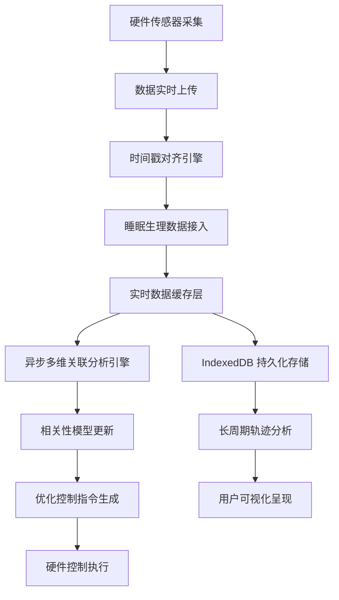
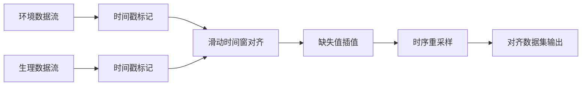

## 1. 产品概述

SleepMatrix 是一款基于 SolidJS 的睡眠环境质量智能分析系统，实现光温噪传感数据与睡眠生理深度在硬件控制与监测系统间的实时对齐，通过异步多维关联分析引擎优化睡眠环境参数，利用 IndexedDB 记录长周期睡眠轨迹快照，支撑跨场景睡眠健康的数字化协同。

- 核心目标：建立环境参数（光照、温度、噪音）与睡眠质量之间的量化关联模型，为用户提供个性化的睡眠环境优化方案
- 目标用户：关注睡眠健康的个人用户、睡眠研究机构、智能家居生态系统
- 市场价值：填补睡眠环境多维度实时关联分析的空白，为智能家居硬件提供数据驱动的控制决策依据

## 2. 核心功能

### 2.1 用户角色

| 角色 | 注册方式 | 核心权限 |
|------|----------|----------|
| 普通用户 | 邮箱/手机号注册 | 查看个人睡眠数据、环境分析报告、设备控制、历史轨迹回溯 |
| 研究用户 | 机构认证注册 | 批量数据导出、多维交叉分析、自定义关联模型参数 |
| 管理员 | 系统授权 | 用户管理、设备管理、系统配置、数据备份 |

### 2.2 功能模块

1. **实时监测仪表盘**：环境数据实时展示、睡眠深度波形图、设备状态监控、数据对齐状态指示
2. **多维关联分析**：环境-睡眠相关性热力图、异步分析引擎状态、参数敏感度分析、优化建议生成
3. **睡眠轨迹档案**：历史睡眠周期快照、跨场景对比分析、长周期趋势图表、IndexedDB 数据管理
4. **设备控制中心**：硬件设备配置、阈值告警设置、自动控制策略、手动实时控制
5. **数据可视化**：多维度数据看板、自定义图表组合、相关性散点矩阵、时序波形叠加

### 2.3 页面详情

| 页面名称 | 模块名称 | 功能描述 |
|----------|----------|----------|
| 实时监测仪表盘 | 环境参数卡片 | 光照(lux)、温度(°C)、噪音(dB)实时数值与趋势小图 |
| 实时监测仪表盘 | 睡眠波形组件 | 睡眠深度分期波形（深睡/浅睡/REM/清醒）与时间轴 |
| 实时监测仪表盘 | 数据对齐指示器 | 硬件数据与生理数据时间戳对齐状态、延迟指标 |
| 实时监测仪表盘 | 设备状态面板 | 已连接设备列表、在线状态、信号强度、电池电量 |
| 多维关联分析 | 相关性热力图 | 皮尔逊相关系数矩阵，展示各环境参数与睡眠分期的相关性 |
| 多维关联分析 | 异步引擎状态 | 分析任务队列、计算进度、最近更新时间 |
| 多维关联分析 | 敏感度分析 | 各参数变化对睡眠质量影响的边际效应曲线 |
| 多维关联分析 | 优化建议 | 基于当前数据模型生成的环境参数调整建议 |
| 睡眠轨迹档案 | 日历视图 | 睡眠周期日历、每日睡眠评分、异常日期标记 |
| 睡眠轨迹档案 | 快照详情 | 单次睡眠完整数据快照、环境参数时序叠加 |
| 睡眠轨迹档案 | 趋势分析 | 周/月/季度睡眠质量趋势、环境参数变化曲线 |
| 睡眠轨迹档案 | 跨场景对比 | 不同睡眠环境（居家/出差/度假）数据对比 |
| 设备控制中心 | 设备配置 | 传感器校准、采样频率设置、数据上报间隔 |
| 设备控制中心 | 告警规则 | 阈值设置、告警方式（弹窗/邮件/设备联动） |
| 设备控制中心 | 自动策略 | 基于分析结果的闭环控制规则配置 |
| 数据可视化 | 自定义看板 | 拖拽式图表组合、多维度数据透视 |
| 数据可视化 | 散点矩阵图 | 多参数两两相关性散点图矩阵 |

## 3. 核心流程

### 3.1 主业务流程

用户进入系统后，首先在实时监测仪表盘查看当前环境参数与睡眠状态，系统通过异步多维关联分析引擎持续计算环境参数与睡眠质量的相关性。当用户需要深度分析时，可进入多维关联分析页面查看详细的相关性热力图与优化建议。所有睡眠数据自动写入 IndexedDB 进行长周期存储，用户可通过睡眠轨迹档案进行历史回溯与跨场景对比。

### 3.2 数据对齐流程

## 4. 用户界面设计

### 4.1 设计风格

- **主色调**：深邃午夜蓝 (#0F172A) 作为主背景色，营造科技感与夜间使用友好性；月光紫 (#7C3AED) 作为强调色，代表睡眠与梦境；薄荷绿 (#10B981) 作为成功/正常状态指示；暖橙色 (#F59E0B) 用于告警/注意状态。
- **按钮风格**：圆角 8px，微悬浮效果，点击时有微妙的深度变化，支持暗色/亮色自适应。
- **字体**：主标题使用 Space Grotesk，具有科技感的几何无衬线字体；正文字体使用 Inter，保证可读性；数据展示使用 JetBrains Mono 等宽字体，确保数值对齐。
- **布局风格**：卡片式模块化布局，支持响应式网格系统，重要数据卡片采用玻璃拟态（Glassmorphism）效果，营造层次感。
- **图标风格**：线性图标为主，关键数据点使用填充图标，统一 24px 网格设计，支持主题色动态着色。

### 4.2 页面设计概述

| 页面名称 | 模块名称 | UI 元素 |
|----------|----------|----------|
| 实时监测仪表盘 | 环境参数卡片 | 玻璃拟态卡片背景，实时数字动画，微小趋势折线图，状态指示灯 |
| 实时监测仪表盘 | 睡眠波形组件 | Canvas 绘制的波形图，不同睡眠分期使用不同颜色填充，支持缩放/拖拽 |
| 实时监测仪表盘 | 数据对齐指示器 | 脉冲式动画指示对齐状态，延迟数值实时更新，异常时闪烁告警 |
| 多维关联分析 | 相关性热力图 | SVG 热力图，颜色渐变表示相关系数，悬停显示详细数值与显著性 |
| 多维关联分析 | 敏感度曲线 | 双Y轴图表，参数变化率与质量影响曲线叠加，交互高亮关键拐点 |
| 睡眠轨迹档案 | 日历视图 | 热力日历，每日单元格颜色深浅表示睡眠质量，点击展开详情 |
| 睡眠轨迹档案 | 快照详情 | 时间轴设计，多层数据叠加展示，支持横向滑动浏览 |
| 设备控制中心 | 控制滑块 | 自定义范围滑块，实时数值反馈，阻尼动画效果 |

### 4.3 响应式设计

- **桌面端优先**：默认 1920px 宽度设计，采用 12 列栅格系统
- **平板适配**：≥768px 时栅格收缩为 8 列，侧边栏可折叠
- **移动端适配**：<768px 时采用单列布局，底部导航，图表支持触摸缩放
- **触摸优化**：所有交互元素最小 44x44px 触摸区域，滑动手势支持

### 4.4 交互动效

- **页面载入**：卡片错峰渐入动画，延迟 50ms 逐级显示
- **数据更新**：数字滚动动画，波形平滑过渡，避免突兀跳变
- **悬停效果**：卡片微上浮 + 阴影增强，图表数据点高亮放大
- **告警提示**：边框脉冲动画 + 轻微抖动，紧急情况颜色闪烁

---

## 5. 非功能性需求

### 5.1 性能要求
- 实时数据更新延迟 ≤ 100ms
- 异步分析任务响应 ≤ 2s（复杂分析 ≤ 10s）
- 历史数据查询响应 ≤ 500ms（十万级数据量）
- 页面首屏加载 ≤ 2s

### 5.2 可靠性要求
- IndexedDB 数据持久化可靠性 ≥ 99.9%
- 数据对齐准确率 ≥ 99.5%
- 离线状态下本地数据缓存可用

### 5.3 安全性要求
- 敏感数据本地加密存储
- 硬件通信采用 HTTPS/WebSocket Secure
- 用户数据隔离，多账户场景下数据互不可见
