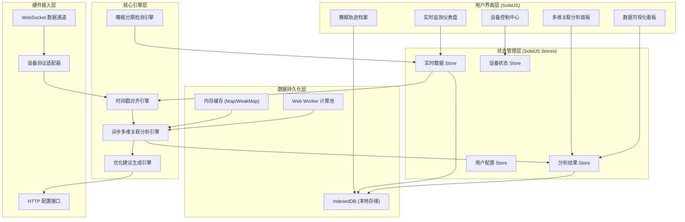
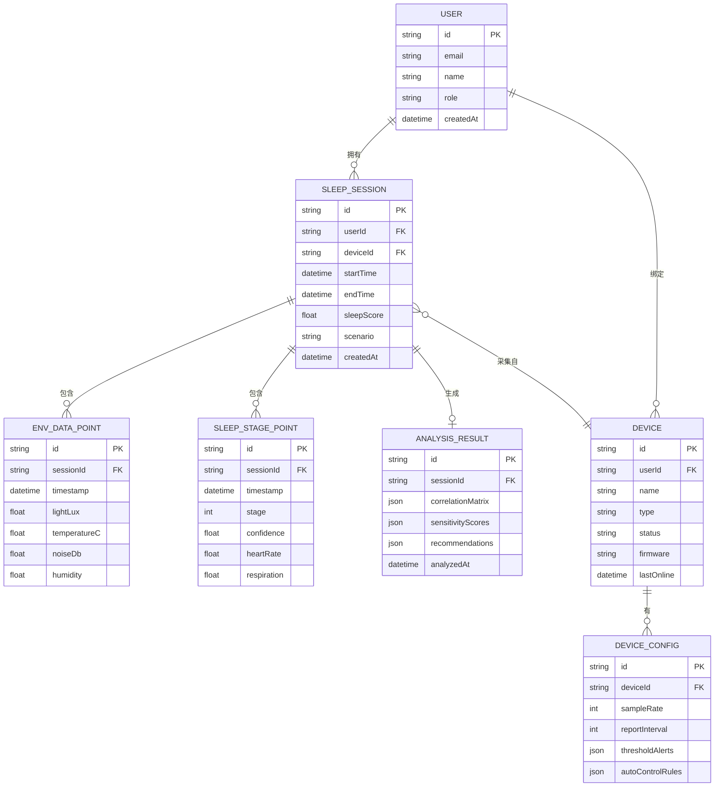

## 1. 架构设计



## 2. 技术栈描述

### 2.1 前端核心
- **框架**: SolidJS@1.8 - 细粒度响应式，高性能数据更新，适合实时数据流场景
- **构建工具**: Vite@5 - 极速热更新，原生 ESM 支持
- **语言**: TypeScript@5 - 类型安全，IDE 智能提示
- **样式**: TailwindCSS@3 - 原子化 CSS，快速构建响应式界面
- **路由**: @solidjs/router@0.13 - 类型安全的文件式路由

### 2.2 数据可视化
- **图表库**: ECharts@5 - 高性能时序图表，支持 Canvas/SVG 双模式
- **波形绘制**: Canvas API + OffscreenCanvas - 高性能睡眠波形渲染
- **热力图**: 自定义 SVG 实现 - 相关性矩阵可视化
- **动画**: Motion One@10 - 轻量级动画库，SolidJS 原生集成

### 2.3 数据存储与计算
- **本地数据库**: IndexedDB (idb@7) - Promise 化封装，支持大容量长周期存储
- **离线缓存**: Service Worker + Cache API - PWA 支持
- **并行计算**: Web Workers + Comlink - 异步分析引擎隔离执行
- **状态管理**: SolidJS Stores (createStore) - 细粒度状态更新

### 2.4 工具库
- **时间处理**: date-fns@3 - 轻量级日期时间计算
- **数学计算**: mathjs@12 - 统计分析、相关系数计算
- **数据校验**: zod@3 - 运行时类型校验
- **UUID**: uuid@9 - 数据记录唯一标识

### 2.5 开发工具
- **代码规范**: ESLint@8 + Prettier@3
- **类型检查**: TypeScript Strict Mode
- **测试**: Vitest@1 + @solidjs/testing-library
- **Git Hooks**: husky + lint-staged

## 3. 目录结构

```
SleepMatrix/
├── src/
│   ├── components/          # 通用组件
│   │   ├── charts/         # 图表组件
│   │   ├── cards/          # 卡片组件
│   │   ├── controls/       # 控制组件
│   │   └── layout/         # 布局组件
│   ├── pages/              # 页面组件
│   │   ├── dashboard/      # 实时监测仪表盘
│   │   ├── analysis/       # 多维关联分析
│   │   ├── archive/        # 睡眠轨迹档案
│   │   ├── devices/        # 设备控制中心
│   │   └── visualize/      # 数据可视化
│   ├── stores/             # 状态管理
│   │   ├── realtime.ts     # 实时数据 Store
│   │   ├── analysis.ts     # 分析结果 Store
│   │   ├── devices.ts      # 设备状态 Store
│   │   └── config.ts       # 用户配置 Store
│   ├── engine/             # 核心引擎
│   │   ├── alignment.ts    # 时间戳对齐引擎
│   │   ├── correlation.ts  # 多维关联分析引擎
│   │   ├── sleepStage.ts   # 睡眠分期检测引擎
│   │   └── optimizer.ts    # 优化建议生成引擎
│   ├── db/                 # 数据持久化
│   │   ├── indexeddb.ts    # IndexedDB 封装
│   │   ├── schema.ts       # 数据模型定义
│   │   └── migrations/     # 数据库迁移
│   ├── workers/            # Web Workers
│   │   ├── analysis.worker.ts  # 分析计算 Worker
│   │   └── alignment.worker.ts # 数据对齐 Worker
│   ├── services/           # 外部服务
│   │   ├── websocket.ts    # WebSocket 连接管理
│   │   ├── http.ts         # HTTP 请求封装
│   │   └── deviceApi.ts    # 设备 API 封装
│   ├── types/              # TypeScript 类型定义
│   │   ├── data.ts         # 数据类型
│   │   ├── device.ts       # 设备类型
│   │   └── analysis.ts     # 分析结果类型
│   ├── utils/              # 工具函数
│   │   ├── math.ts         # 数学计算
│   │   ├── time.ts         # 时间处理
│   │   └── validation.ts   # 数据校验
│   ├── hooks/              # 自定义 Hooks
│   │   ├── useRealtime.ts  # 实时数据 Hook
│   │   ├── useAnalysis.ts  # 分析引擎 Hook
│   │   └── useDevice.ts    # 设备控制 Hook
│   ├── styles/             # 全局样式
│   │   ├── index.css       # 样式入口
│   │   └── variables.css   # CSS 变量定义
│   ├── App.tsx             # 应用入口
│   ├── main.tsx            # 渲染入口
│   └── router.tsx          # 路由配置
├── public/                 # 静态资源
├── mock/                   # Mock 数据
│   ├── sensors.ts          # 传感器模拟数据
│   ├── sleep.ts            # 睡眠数据模拟
│   └── devices.ts          # 设备模拟数据
├── .trae/
│   └── documents/          # 项目文档
├── vite.config.ts          # Vite 配置
├── tsconfig.json           # TypeScript 配置
├── tailwind.config.ts      # TailwindCSS 配置
├── package.json            # 依赖配置
└── index.html              # HTML 入口
```

## 4. 路由定义

| 路由路径 | 页面名称 | 主要功能 |
|----------|----------|----------|
| `/` | 实时监测仪表盘 | 环境参数实时展示、睡眠波形、数据对齐状态 |
| `/analysis` | 多维关联分析 | 相关性热力图、敏感度分析、优化建议 |
| `/archive` | 睡眠轨迹档案 | 日历视图、历史快照、长周期趋势 |
| `/archive/:id` | 快照详情页 | 单次睡眠完整数据展示 |
| `/devices` | 设备控制中心 | 设备列表、配置管理、告警规则 |
| `/visualize` | 数据可视化 | 自定义看板、散点矩阵、多维度分析 |
| `/settings` | 系统设置 | 用户配置、数据管理、关于系统 |

## 5. 数据模型

### 5.1 实体关系图



### 5.2 IndexedDB 存储方案

#### 数据库名: `sleepmatrix_db`
#### 版本: 1

| Object Store | 主键 | 索引 | 存储容量 |
|--------------|------|------|----------|
| `sleep_sessions` | `id` | `userId`, `startTime`, `scenario` | 无限制 |
| `env_data_points` | `id` | `sessionId`, `timestamp` | 支持百万级 |
| `sleep_stage_points` | `id` | `sessionId`, `timestamp` | 支持百万级 |
| `analysis_results` | `id` | `sessionId`, `analyzedAt` | 无限制 |
| `devices` | `id` | `userId`, `status` | 无限制 |
| `device_configs` | `id` | `deviceId` | 无限制 |
| `settings` | `key` | - | 配置数据 |

### 5.3 关键数据类型定义

```typescript
// 环境数据点
interface EnvDataPoint {
  id: string;
  sessionId: string;
  timestamp: number;
  lightLux: number;
  temperatureC: number;
  noiseDb: number;
  humidity?: number;
}

// 睡眠分期数据点
interface SleepStagePoint {
  id: string;
  sessionId: string;
  timestamp: number;
  stage: 0 | 1 | 2 | 3 | 4; // 0=清醒, 1=REM, 2=浅睡, 3=深睡, 4=未知
  confidence: number;
  heartRate?: number;
  respiration?: number;
  movement?: number;
}

// 对齐后的数据点
interface AlignedDataPoint {
  timestamp: number;
  env: EnvDataPoint;
  sleep: SleepStagePoint;
  alignmentScore: number; // 0-1, 数据对齐质量
}

// 相关性分析结果
interface CorrelationResult {
  variableX: string;
  variableY: string;
  pearson: number;
  spearman: number;
  pValue: number;
  sampleSize: number;
}

// 分析结果
interface AnalysisResult {
  id: string;
  sessionId: string;
  correlationMatrix: CorrelationResult[][];
  sensitivityScores: Record<string, number>;
  recommendations: Recommendation[];
  analyzedAt: number;
}

// 优化建议
interface Recommendation {
  id: string;
  type: 'light' | 'temperature' | 'noise' | 'combined';
  priority: 'high' | 'medium' | 'low';
  parameter: string;
  currentValue: number;
  targetRange: [number, number];
  expectedImprovement: number;
  confidence: number;
  description: string;
}
```

## 6. 核心引擎设计

### 6.1 时间戳对齐引擎

**核心算法**: 滑动时间窗 + 加权线性插值

```
对齐流程:
1. 以 1Hz 频率生成目标时间轴
2. 对每条数据流维护一个滑动窗口 (±2s)
3. 在窗口内查找最近的前后两个数据点
4. 根据时间距离计算加权系数
5. 执行线性插值生成对齐后的数据点
6. 计算对齐质量分数 (基于数据点密度与距离)
```

### 6.2 异步多维关联分析引擎

**并行计算架构**:
- 主线程: 任务调度、结果聚合、UI 更新
- Worker 池: 3-5 个计算 Worker，根据 CPU 核心数动态调整
- 任务队列: 优先级队列，支持任务取消与重试

**分析方法**:
- 皮尔逊相关系数 (线性相关)
- 斯皮尔曼等级相关 (单调相关)
- 偏相关分析 (控制变量影响)
- 时滞互相关 (时间偏移相关性)
- 格兰杰因果检验 (预测性关系)

### 6.3 睡眠分期检测引擎

**规则引擎 + 启发式算法**:
- 基于心率变异性 (HRV) 特征
- 结合体动检测
- 睡眠周期连续性约束
- 实时置信度评估

## 7. API 接口定义 (模拟)

### 7.1 WebSocket 实时数据通道

**连接地址**: `wss://api.sleepmatrix.example.com/v1/realtime`

**接收消息**:
```typescript
interface SensorDataMessage {
  type: 'sensor_data';
  deviceId: string;
  timestamp: number;
  data: {
    lightLux: number;
    temperatureC: number;
    noiseDb: number;
    humidity: number;
  };
}

interface SleepStageMessage {
  type: 'sleep_stage';
  deviceId: string;
  timestamp: number;
  data: {
    stage: number;
    confidence: number;
    heartRate: number;
    respiration: number;
  };
}
```

### 7.2 设备控制接口

**POST** `/api/v1/devices/:id/control`
```typescript
interface ControlRequest {
  command: 'set_parameter' | 'calibrate' | 'reboot';
  parameter?: string;
  value?: number;
}
```

## 8. 性能优化策略

1. **虚拟列表**: 历史数据长列表采用虚拟滚动，仅渲染可视区域
2. **Web Worker**: 所有计算密集型任务移至 Worker 执行，不阻塞 UI
3. **数据分页**: IndexedDB 查询采用游标分页，避免一次性加载大量数据
4. **请求防抖**: 用户操作防抖处理，减少不必要的计算
5. **内存回收**: 大对象及时释放引用，避免内存泄漏
6. **缓存策略**: 高频访问数据采用 LRU 缓存，减少 IndexedDB 读取

## 9. 错误处理与重试机制

1. **WebSocket 重连**: 指数退避算法，最大重连间隔 30s
2. **IndexedDB 容错**: 事务失败自动重试，数据写入双备份
3. **计算超时**: Worker 任务超时自动终止，避免资源耗尽
4. **边界情况**: 数据缺失、异常值检测与处理机制
