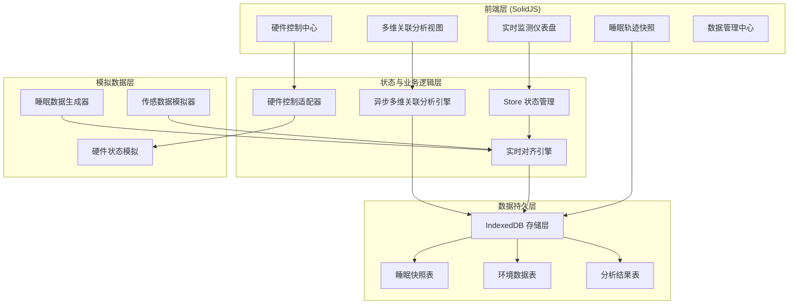
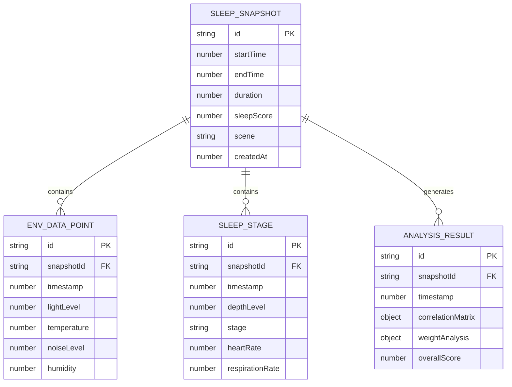

# SleepMatrix - 技术架构文档

## 1. 架构设计



## 2. 技术选型说明

| 层级 | 技术栈 | 说明 |
|------|--------|------|
| 前端框架 | SolidJS 1.x | 响应式 UI 框架，高性能细粒度更新 |
| 构建工具 | Vite 5.x | 极速开发构建工具 |
| 语言 | TypeScript 5.x | 类型安全 |
| 样式方案 | TailwindCSS 3.x | 原子化 CSS 框架 |
| 状态管理 | @solid-primitives/context + createStore | SolidJS 原生状态管理 |
| 路由 | @solidjs/router | SolidJS 官方路由 |
| 图表可视化 | Canvas API (原生绘制) | 高性能实时波形与热力图 |
| 本地数据库 | IndexedDB (idb 封装) | 长周期睡眠轨迹持久化存储 |
| 图标 | lucide-solid | 现代线性图标库 |

## 3. 路由定义

| 路由路径 | 页面名称 | 说明 |
|-----------|----------|------|
| / | 实时监测页 | 默认首页，展示实时环境数据与睡眠深度 |
| /analysis | 关联分析页 | 多维相关性热力图与影响权重分析 |
| /timeline | 睡眠轨迹页 | 长周期睡眠快照时间轴浏览 |
| /control | 硬件控制页 | 环境参数调节与场景模式切换 |
| /data | 数据管理页 | IndexedDB 存储管理与数据导入导出 |

## 4. 核心数据模型

### 4.1 数据模型 ER 图



### 4.2 IndexedDB Store 设计

| Store 名称 | 主键 | 索引 | 说明 |
|------------|------|------|------|
| sleep_snapshots | id | startTime, scene, createdAt | 睡眠快照元数据 |
| env_data_points | id | snapshotId, timestamp | 环境传感数据点 |
| sleep_stages | id | snapshotId, timestamp | 睡眠阶段数据 |
| analysis_results | id | snapshotId, timestamp | 分析结果缓存 |
| device_status | id | type, lastUpdate | 硬件设备状态 |

### 4.3 核心类型定义

```typescript
interface EnvironmentData {
  timestamp: number;
  lightLevel: number;
  temperature: number;
  noiseLevel: number;
  humidity: number;
}

interface SleepStageData {
  timestamp: number;
  depthLevel: number;
  stage: 'wake' | 'light' | 'deep' | 'rem';
  heartRate: number;
  respirationRate: number;
}

interface SleepSnapshot {
  id: string;
  startTime: number;
  endTime: number;
  duration: number;
  sleepScore: number;
  scene: string;
  envData: EnvironmentData[];
  sleepStages: SleepStageData[];
  analysis?: AnalysisResult;
  createdAt: number;
}

interface CorrelationResult {
  lightVsDepth: number;
  tempVsDepth: number;
  noiseVsDepth: number;
  humidityVsDepth: number;
  lightTemp: number;
  lightNoise: number;
  tempNoise: number;
}

interface AnalysisResult {
  id: string;
  snapshotId: string;
  timestamp: number;
  correlationMatrix: CorrelationResult;
  weightAnalysis: {
    factor: string;
    weight: number;
    impact: 'positive' | 'negative' | 'neutral';
  }[];
  overallScore: number;
}
```

## 5. 模块架构

### 5.1 目录结构

```
src/
├── components/          # 可复用组件
│   ├── charts/         # 图表组件
│   ├── cards/          # 数据卡片
│   ├── controls/       # 控制组件
│   └── layout/         # 布局组件
├── pages/              # 页面组件
│   ├── Dashboard.tsx
│   ├── Analysis.tsx
│   ├── Timeline.tsx
│   ├── Control.tsx
│   └── DataManage.tsx
├── stores/             # 状态管理
│   ├── sleepStore.ts
│   ├── deviceStore.ts
│   └── analysisStore.ts
├── utils/              # 工具函数
│   ├── correlation.ts  # 相关性计算
│   ├── alignment.ts    # 数据对齐
│   └── time.ts         # 时间工具
├── db/                 # IndexedDB 封装
│   ├── index.ts
│   ├── schema.ts
│   └── operations.ts
├── mock/               # 模拟数据
│   ├── sensorSimulator.ts
│   └── sleepGenerator.ts
├── types/              # TypeScript 类型
│   └── index.ts
├── App.tsx
├── main.tsx
└── index.css
```

### 5.2 异步多维关联分析引擎

**核心职责**：
- 异步计算多维环境参数与睡眠生理深度的相关性
- 支持 Pearson 与 Spearman 两种相关系数算法
- 时间窗口滑动分析，捕捉延迟效应
- Web Worker 后台计算，避免阻塞 UI

**算法流程**：
1. 从 IndexedDB 获取指定时间范围的数据
2. 数据对齐：将不同采样率的数据按时间轴插值对齐
3. 滑动窗口计算：按时间窗口分段计算相关性
4. 权重分析：基于相关系数与影响幅度计算综合权重
5. 结果缓存：将分析结果存入 IndexedDB 加速后续访问

## 6. 性能优化策略

- **虚拟滚动**：长周期睡眠轨迹采用虚拟列表
- **Canvas 绘制**：实时波形与热力图使用 Canvas 原生绘制
- **数据分片**：IndexedDB 查询按时间分片加载
- **Web Worker**：关联分析在 Worker 线程执行
- **RequestAnimationFrame**：动画与数据更新对齐帧频
- **内存管理**：及时释放历史数据引用，避免内存泄漏

## 7. 跨场景协同设计

- **场景标识**：每条睡眠快照附带场景标签（卧室/旅行/午休等）
- **数据导出**：支持 JSON/CSV 格式导出，便于跨设备同步
- **快照对比**：支持多场景睡眠数据并排对比分析
- **趋势分析**：长周期跨场景睡眠质量趋势追踪
